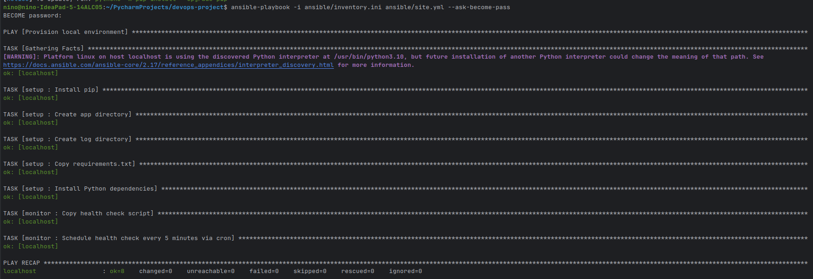
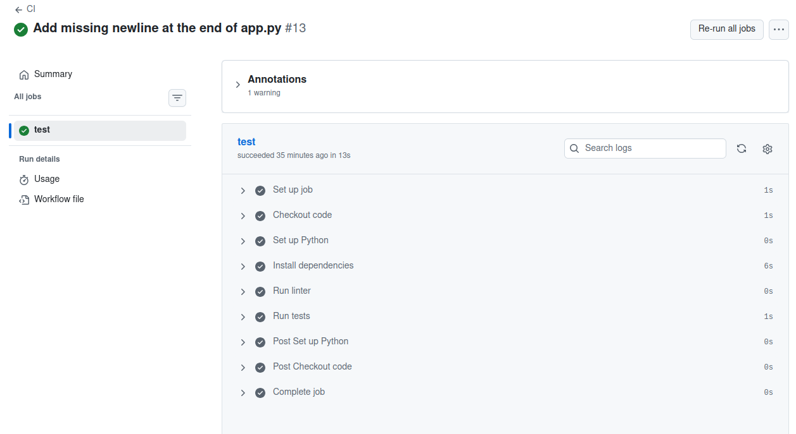
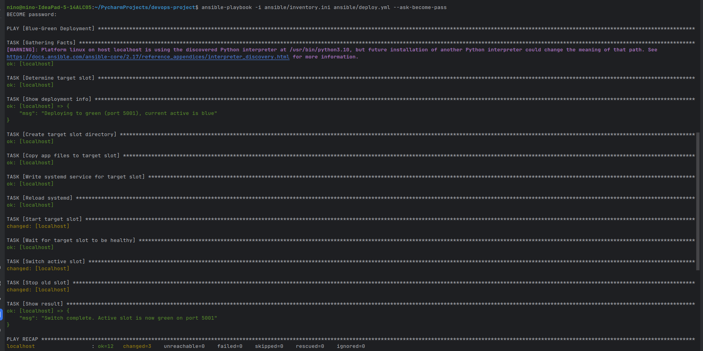
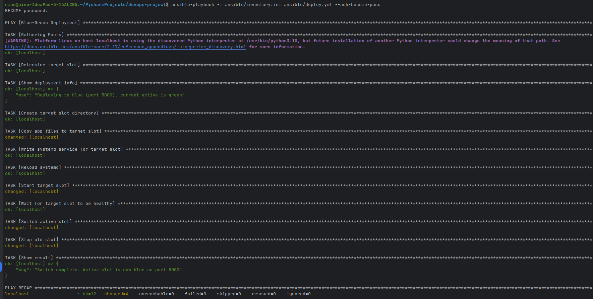
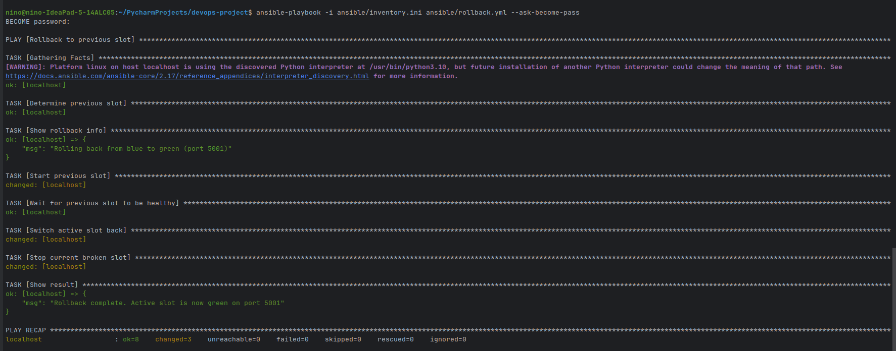

# DevOps Project

A complete DevOps pipeline using Python/Flask, Ansible and GitHub Actions with blue-green deployment on localhost.

---

## Tech Stack

| Layer | Tool |
|---|---|
| Web framework | Python 3.10 + Flask |
| Testing | pytest |
| Linting | flake8 |
| Version control | Git + GitHub |
| CI pipeline | GitHub Actions |
| IaC & automation | Ansible |
| Deployment strategy | Blue-green deployment |
| Process management | systemd |
| Monitoring | Python script + cron |

---

## Project Structure
```
devops-project/
├── app/
│   ├── app.py
│   ├── static/style.css
│   └── templates/
│       ├── index.html
│       └── result.html
├── tests/
│   └── test_app.py
├── ansible/
│   ├── inventory.ini
│   ├── site.yml
│   ├── deploy.yml
│   ├── rollback.yml
│   ├── active_slot.yml
│   ├── templates/app.service.j2
│   └── roles/
│       ├── setup/tasks/main.yml
│       ├── deploy/tasks/main.yml
│       └── monitor/
│           ├── tasks/main.yml
│           └── files/health_check.py
├── .github/workflows/ci.yml
├── requirements.txt
└── .flake8
```

---

## CI/CD Workflow Diagram


---

## Prerequisites

- Ubuntu 20.04+
- Python 3.10+
- pip3
- Ansible — `sudo apt install ansible -y`
- Git

---

## Step 1 — Clone the repository

```bash
git clone https://github.com/gorozia0709/devops-project.git
cd devops-project
```

---

## Step 2 — Install dependencies locally

```bash
pip install -r requirements.txt
```

---

## Step 3 — Run tests

```bash
python3 -m pytest tests/ -v
```

All 4 tests should pass.


---

## Step 4 — Run the app locally

```bash
SLOT=blue PORT=5000 python3 app/app.py
```

Open `http://localhost:5000` in your browser.

---

## Step 5 — Provision the environment (single command)

This installs dependencies, creates directories, deploys the health check script and schedules the cron job:

```bash
ansible-playbook -i ansible/inventory.ini ansible/site.yml --ask-become-pass
```

What it does:
- Installs Python and pip via apt
- Creates `/opt/devops-app/` and `/var/log/devops-app/`
- Copies `requirements.txt` and installs Flask and pytest
- Deploys `health_check.py` to `/opt/devops-app/`
- Schedules a cron job to run the health check every 5 minutes


---

## Step 6 — CI Pipeline

GitHub Actions runs automatically on every push to `main` or `dev`, and on every Pull Request targeting `main`.

Pipeline steps:
1. Checkout code
2. Set up Python 3.10
3. Install dependencies from `requirements.txt`
4. Run `flake8` linter on `app/` and `tests/`
5. Run `pytest` unit tests



---

## Step 7 — Blue-Green Deployment

```bash
ansible-playbook -i ansible/inventory.ini ansible/deploy.yml --ask-become-pass
```

How it works:
1. Reads `active_slot.yml` to find the current active slot
2. Deploys new code to the idle slot
3. Starts the idle slot as a systemd service
4. Runs a health check against the `/health` endpoint
5. If healthy — switches active slot, stops old slot
6. If unhealthy — aborts, old slot keeps serving traffic

| Slot | Port | Badge color |
|------|------|-------------|
| blue | 5000 | Blue |
| green | 5001 | Green |

Every deployment flips between slots with zero downtime.



First deploy to green slot:


Now after some change is done and pushed to repository we get following results:




---

## Step 8 — Rollback

To instantly revert to the previous slot:

```bash
ansible-playbook -i ansible/inventory.ini ansible/rollback.yml --ask-become-pass
```

This starts the previously stopped slot, health checks it, switches traffic back, and stops the broken slot.




---

## Step 9 — Monitoring & Health Check

The health check script polls both slots and logs results. It is scheduled via cron every 5 minutes by Ansible.

Run manually:

```bash
python3 /opt/devops-app/health_check.py
```

View the log:

```bash
cat /var/log/devops-app/health.log
```

Example output: